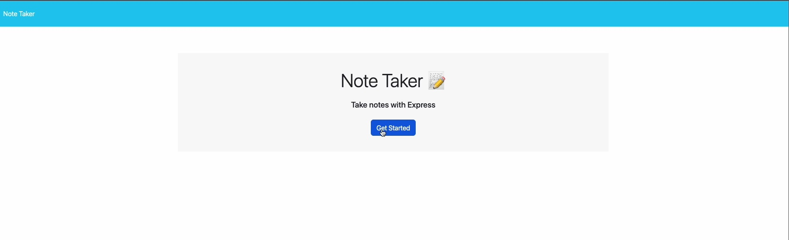
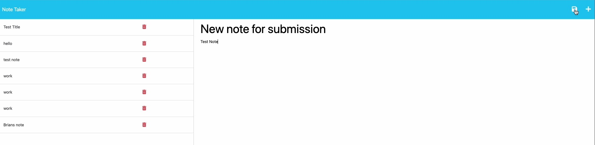
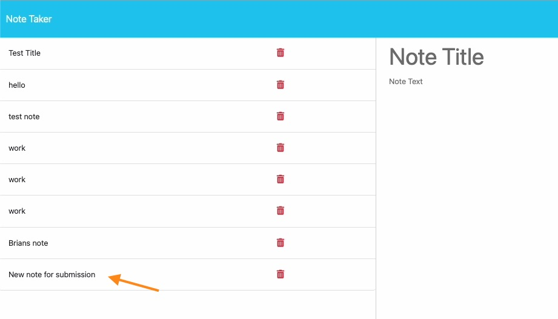

# takeGoodNotes

## Description

This app will allow the end-user, to write and store notes.
Express.js was utilized, to establish the routes, making the starter code operate as originally intended. FS package was utilized, as a local database to track, store, and recall saved notes.

The deployed app may be found @: 
><https://infinite-fortress-52013-346913409894.herokuapp.com/>

## Installation

1. Clone this repo onto your system

2. Run `npm install` to install all dependencies

3. Run `npm start` to start the app

4. Go to <http://localhost:3001>

5. Take some notes!

## Usage

This app may be used to create, store and delete notes for your everyday life.

## Contributions

Starter code obtained from:

><https://github.com/coding-boot-camp/miniature-eureka>

## Questions

GitHub account:

>[https://github.com/BrianJohnMaher](https://github.com/BrianJohnMaher)

Reach me through email here to ask any questions about the app!

>Email: [BMaher22@mac.com](mailto:BMaher22@mac.com)